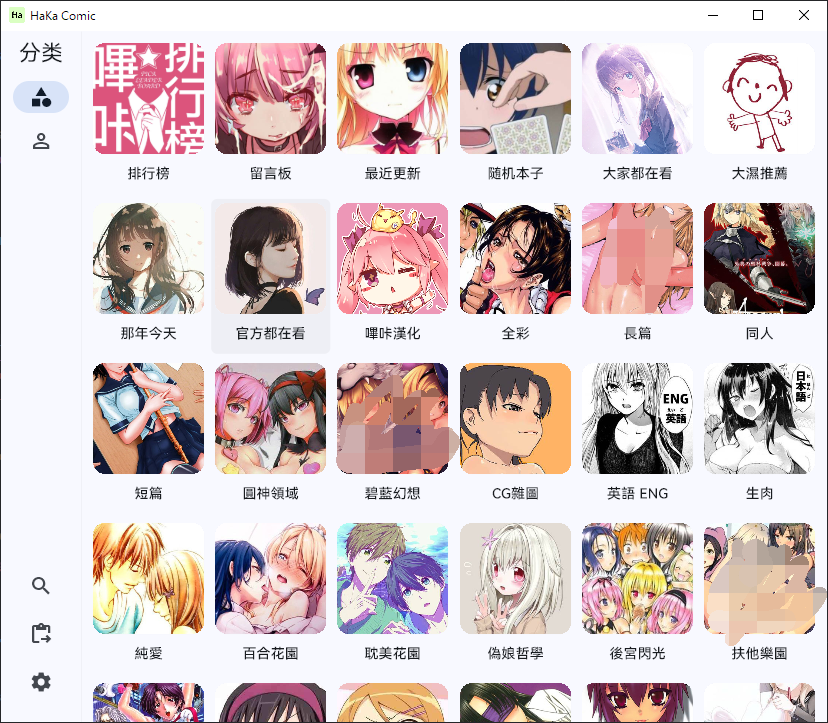
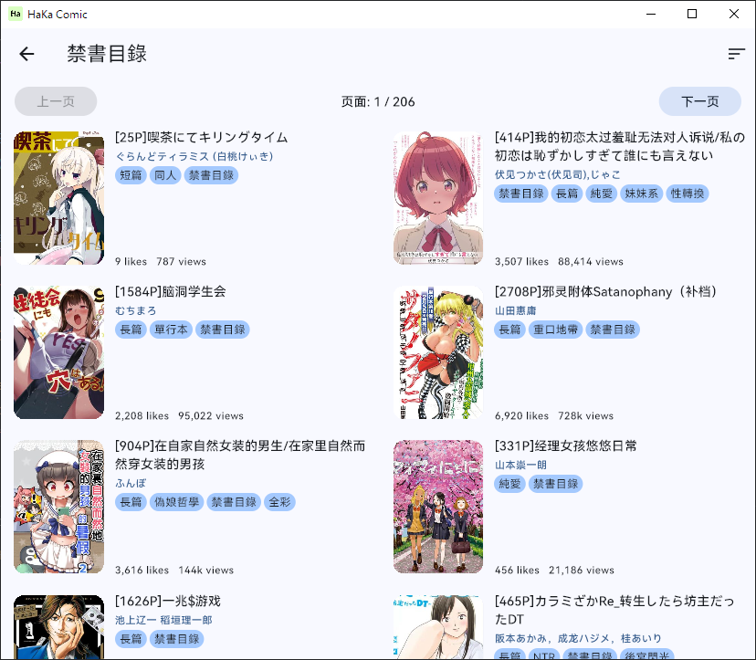
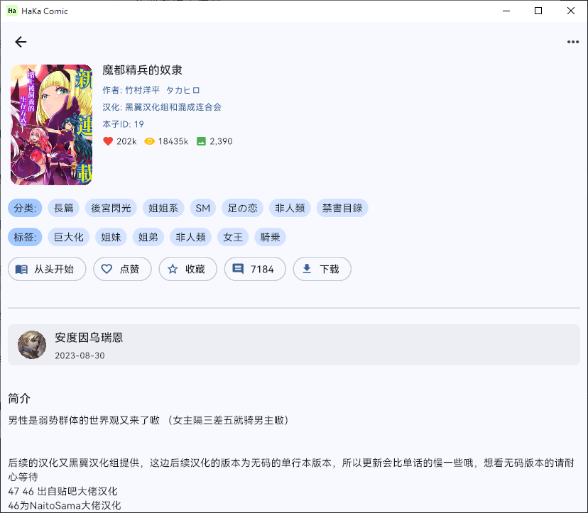
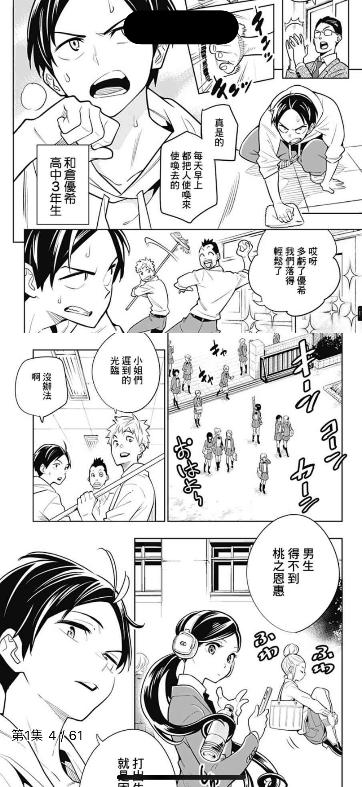
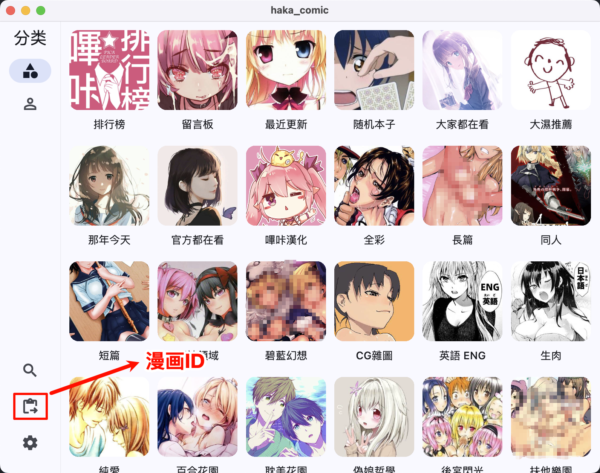
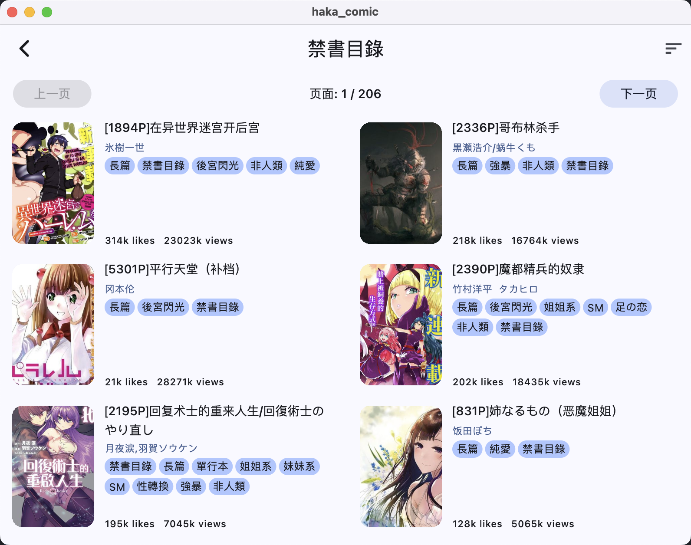
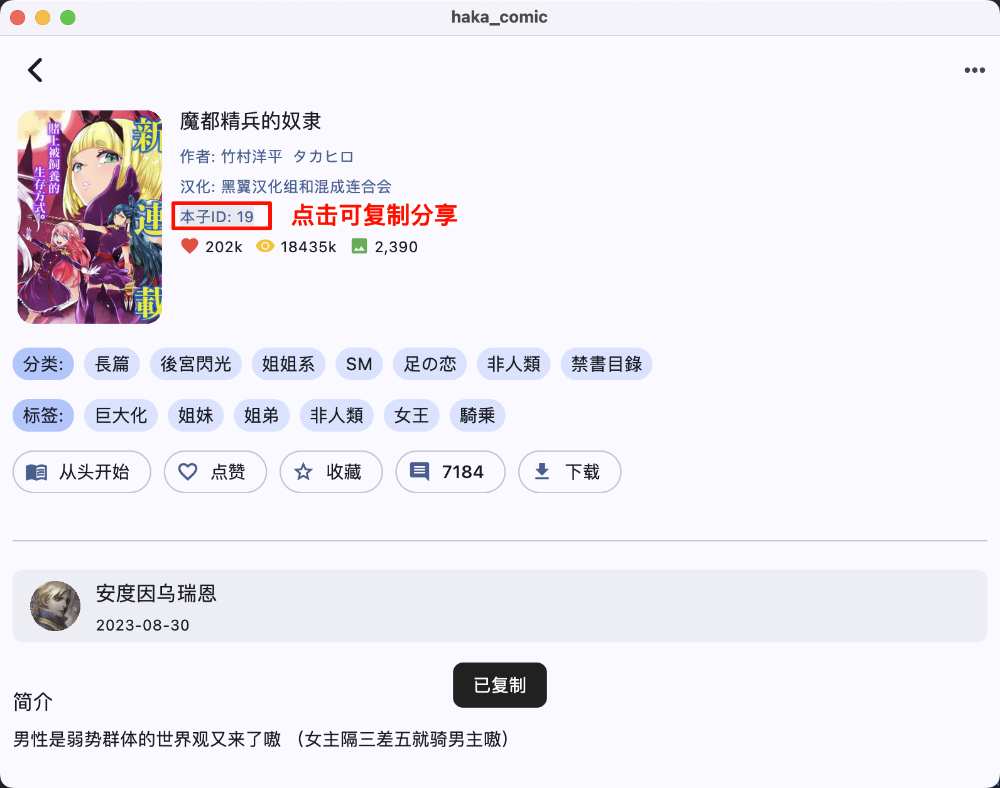
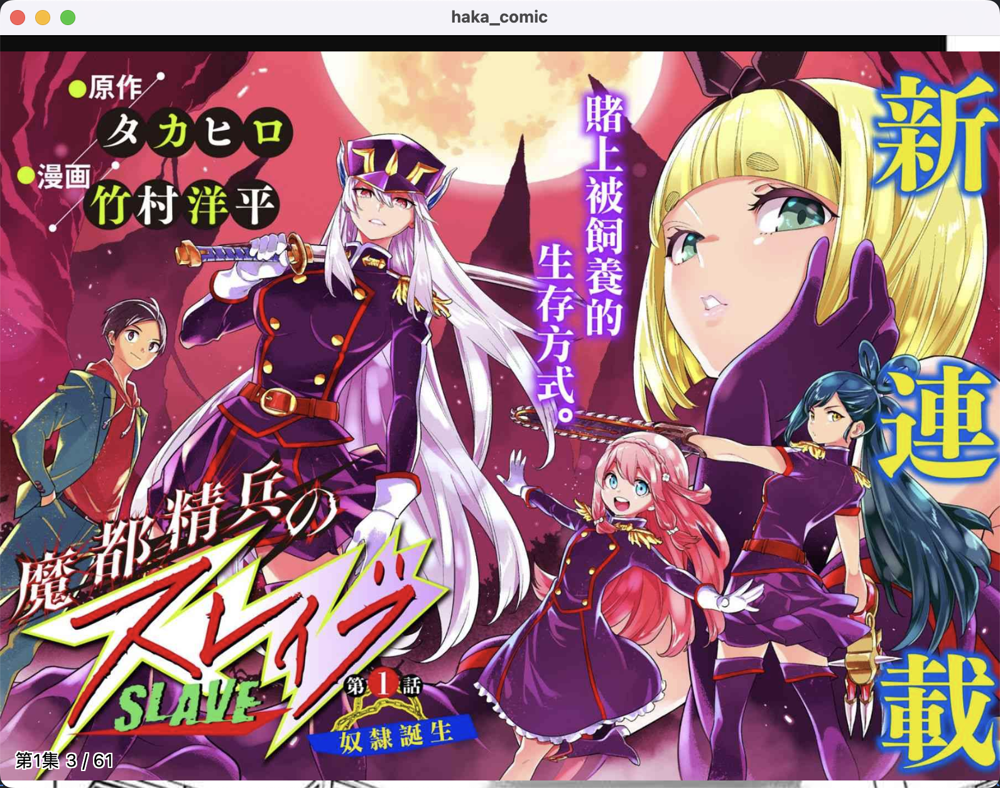

# HaKa Comic

## 📖 项目简介

第三方哗咔漫画跨平台客户端。**练习项目**，目标是支持 Android、iOS、Mac 和 Windows 四个平台，目前仍在持续完善中（目前PC端还未完全适配，所以暂不发布PC端的release包）。欢迎给个star⭐️支持一下。

---

## ✨ 核心功能

- 🆔 **漫画 ID 分享**  
  支持官方最新分享漫画 ID 功能，详情页可直接复制漫画 ID（使用 ID 见截图红圈标注）
- 🌐 **多平台适配**  
  兼容移动端与桌面端设备（Android/iOS/Mac/Windows）

---

## 🖼️ 项目截图

| 分类浏览                                          | 漫画列表                                              | 漫画详情                                              | 阅读界面                                          |
| ------------------------------------------------- | ----------------------------------------------------- | ----------------------------------------------------- | ------------------------------------------------- |
|     |     |     |     |
|  |  |  |  |

---

## ⚠️ 免责声明

1. 本项目为**非官方第三方应用**，与哔咔漫画官方无任何关联
2. 仅用于**技术交流与学习**目的，禁止用于商业用途
3. 使用本软件产生的一切后果由使用者自行承担
4. 资源内容版权归原作者及平台所有，请于下载后 24 小时内删除

---
