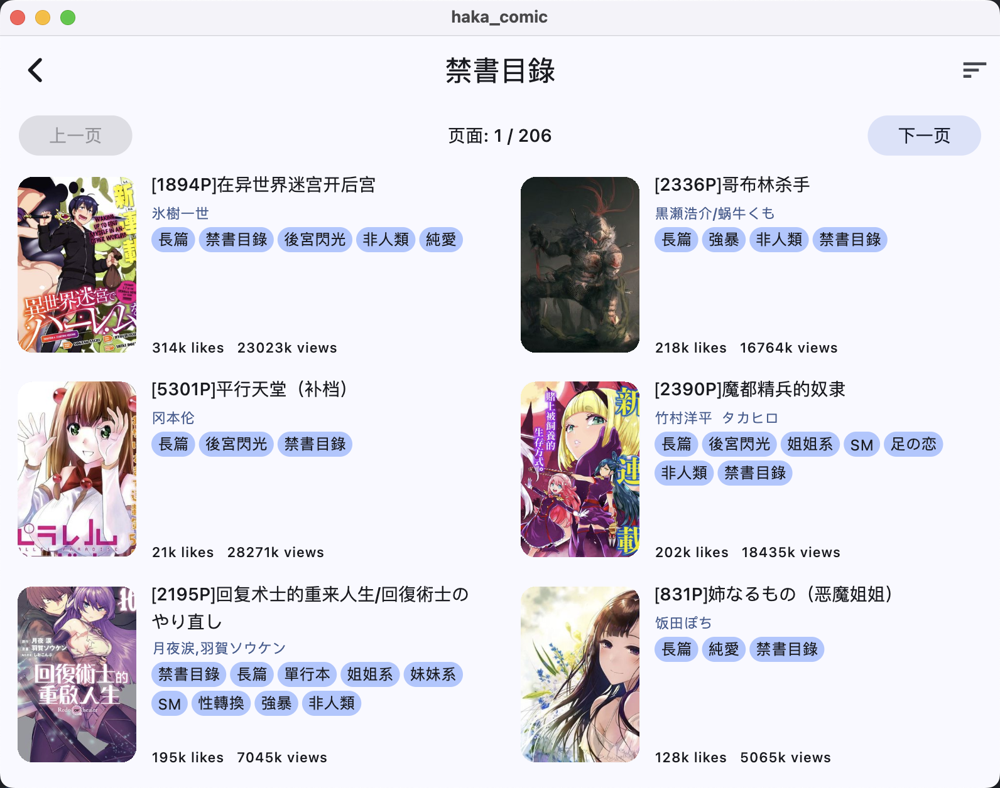
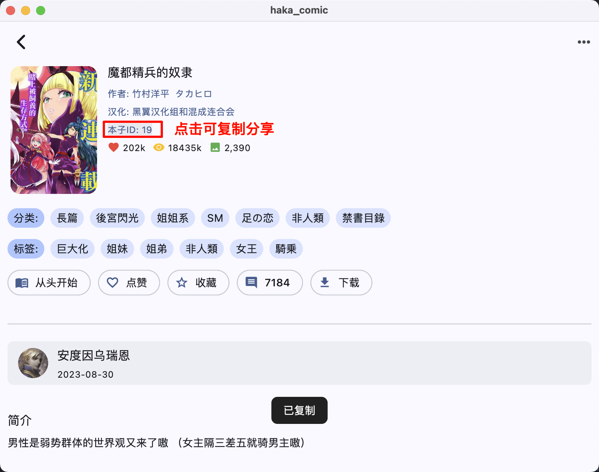

# HaKa Comic

## 📖 项目简介

第三方哗咔漫画跨平台客户端。**学习 flutter 的练习项目**，支持 Android、iOS、Mac、Windows、Linux平台，目前仍在持续完善中。如果觉得项目有帮助，欢迎给个 star ⭐ 支持一下

---

## ⬇️ 下载

所有平台安装包都在 GitHub [Releases](https://github.com/raoxwup/haka_comic/releases)。

| 平台    | Release 资产文件名                                                                                                                                                                           | 选择建议 / 备注                                                                                                                                                                                                                                                                                |
| ------- | -------------------------------------------------------------------------------------------------------------------------------------------------------------------------------------------- | ---------------------------------------------------------------------------------------------------------------------------------------------------------------------------------------------------------------------------------------------------------------------------------------------- |
| Android | `app-arm64-v8a-release-v{version}.apk`（推荐） `app-universal-release-v{version}.apk`（通用） `app-armeabi-v7a-release-v{version}.apk` / `app-x86_64-release-v{version}.apk`（可选） | 大多数真机选 `arm64-v8a`；不确定就选 `universal`（体积更大）。`x86_64` 通常用于模拟器。                                                                                                                                                                                                        |
| iOS     | `no-codesign-ios-v{version}.ipa`                                                                                                                                                             | **未签名 IPA**，需要自签/侧载后才能安装。推荐用 SideStore/AltStore：添加源 `alt_store.json`（`https://raw.githubusercontent.com/raoxwup/haka_comic/main/alt_store.json`），并按官方文档完成前置配置（如 [SideStore 安装前置](https://docs.sidestore.io/zh/docs/installation/prerequisites)）。 |
| macOS   | `HaKa Comic-v{version}.dmg`                                                                                                                                                                  | DMG 安装包（未做公证/签名时，首次打开可能需要在系统安全设置里手动允许）。                                                                                                                                                                                                                      |
| Windows | `HaKa Comic-Setup-v{version}.exe`                                                                                                                                                            | Inno Setup 安装器（可能会触发 SmartScreen 提示，按需放行）。                                                                                                                                                                                                                                   |
| Linux   | `haka-comic-v{version}-amd64.deb` / `haka-comic-v{version}-arm64.deb`                                                                                                                        | Debian/Ubuntu 系：`sudo apt install ./xxx.deb`。目前仅提供 `.deb`。                                                                                                                                                                                                                            |

> 提示：`{version}` 为版本号（例如 `1.1.3`），Release 中实际文件名以页面展示为准。

---

## 🛠️ 开发环境

| 组件           | 版本要求                                             | 官网安装指南                                                       | 验证命令                                  |
| -------------- | ---------------------------------------------------- | ------------------------------------------------------------------ | ----------------------------------------- |
| Flutter SDK    | `3.41.2`（见 `pubspec.yaml`）                        | [Flutter 安装文档](https://docs.flutter.dev/get-started/install)   | `flutter --version` / `flutter doctor -v` |
| Dart SDK       | `>= 3.10.0 < 4.0.0`（见 `pubspec.yaml`）             | [Dart SDK 安装文档](https://dart.dev/get-dart)                     | `dart --version`                          |
| Rust toolchain | 建议使用 stable（本项目 Rust crate 为 edition 2021） | [Rust 安装文档（rustup）](https://www.rust-lang.org/tools/install) | `rustc --version` / `cargo --version`     |

> 说明：Flutter SDK 自带 Dart SDK；如果你已经安装了 Flutter，一般无需再单独安装 Dart。

---

## 🖼️ 项目截图

| 分类浏览                                          | 漫画列表                                              | 漫画详情                                              | 阅读界面                                          |
| ------------------------------------------------- | ----------------------------------------------------- | ----------------------------------------------------- | ------------------------------------------------- |
|     |     |     |     |
|  |  |  |  |

**截图已经过时，以实际项目界面为主**

---

## ⚠️ 免责声明

1. 本项目为**非官方第三方应用**，与哔咔漫画官方无任何关联
2. 仅用于**技术交流与学习**目的，禁止用于商业用途
3. 使用本软件产生的一切后果由使用者自行承担
4. 资源内容版权归原作者及平台所有，请于下载后 24 小时内删除

---
